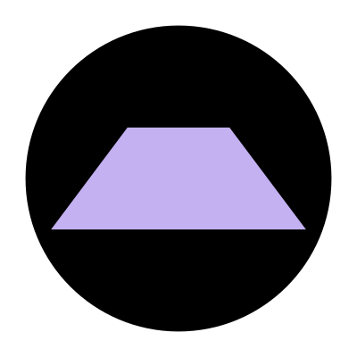

<!-- Improved compatibility of back to top link: See: https://github.com/othneildrew/Best-README-Template/pull/73 -->

<a name="readme-top"></a>

<!--
*** Thanks for checking out the Best-README-Template. If you have a suggestion
*** that would make this better, please fork the repo and create a pull request
*** or simply open an issue with the tag "enhancement".
*** Don't forget to give the project a star!
*** Thanks again! Now go create something AMAZING! :D
-->

<!-- PROJECT SHIELDS -->
<!--
*** I'm using markdown "reference style" links for readability.
*** Reference links are enclosed in brackets [ ] instead of parentheses ( ).
*** See the bottom of this document for the declaration of the reference variables
*** for contributors-url, forks-url, etc. This is an optional, concise syntax you may use.
*** https://www.markdownguide.org/basic-syntax/#reference-style-links
-->

[![Contributors][contributors-shield]][contributors-url]
[![Forks][forks-shield]][forks-url]
[![Stargazers][stars-shield]][stars-url]
[![Issues][issues-shield]][issues-url]
[![MIT License][license-shield]][license-url]

<!-- [![LinkedIn][linkedin-shield]][linkedin-url] -->

<!-- PROJECT LOGO -->
<br />
<div align="center">
  <a href="https://github.com/femto-g/substratum">
    
  </a>

<h3 align="center">Substratum</h3>

  <p align="center">
    Full stack boilerplate
    <br />
    <a href="https://github.com/femto-g/substratum"><strong>Explore the docs »</strong></a>
    <br />
    <br />
    <a href="https://github.com/femto-g/substratum">View Demo</a>
    ·
    <a href="https://github.com/femto-g/substratum/issues/new?labels=bug&template=bug-report---.md">Report Bug</a>
    ·
    <a href="https://github.com/femto-g/substratum/issues/new?labels=enhancement&template=feature-request---.md">Request Feature</a>
  </p>
</div>

[![TypeScript][TypeScript]][TypeScript-url] [![Next][Next.js]][Next-url] [![React][React.js]][React-url] [![ExpressJS][ExpressJS]][ExpressJS-url] [![Prisma][Prisma]][Prisma-url]

<!-- TABLE OF CONTENTS -->
<details>
  <summary>Table of Contents</summary>
  <ol>
    <li>
      <a href="#about-the-project">About The Project</a>
      <ul>
        <li><a href="#built-with">Built With</a></li>
      </ul>
    </li>
    <li>
      <a href="#getting-started">Getting Started</a>
      <ul>
        <li><a href="#prerequisites">Prerequisites</a></li>
        <li><a href="#installation">Installation</a></li>
      </ul>
    </li>
    <li><a href="#usage">Usage</a></li>
    <li><a href="#roadmap">Roadmap</a></li>
    <li><a href="#contributing">Contributing</a></li>
    <li><a href="#license">License</a></li>
    <li><a href="#contact">Contact</a></li>
    <li><a href="#acknowledgments">Acknowledgments</a></li>
  </ol>
</details>

<!-- ABOUT THE PROJECT -->

## Overview and Motivation

[![Product Name Screen Shot][product-screenshot]](https://example.com)

<!-- Here's a blank template to get started: To avoid retyping too much info. Do a search and replace with your text editor for the following: `femto-g`, `substratum`, `twitter_handle`, `linkedin_username`, `email_client`, `email`, `Substratum`, `project_description` -->

Starting a new project can sometimes come with a feeling of paralysis, especially when faced with the tedium of having to set up boilerplate for the nth time.

I found myself facing this issue, augmented by the fact that between each new project, I was learning more about software development best practices and patterns and of course new technologies, which made it hard to reuse code from previous projects.

This repository serves as a starting point for a full stack project, with good patterns and architecture and many useful features already set up.

<p align="right">(<a href="#readme-top">back to top</a>)</p>

<!-- ### Built With

[![Next][Next.js]][Next-url] [![React][React.js]][React-url] [![Prisma][Prisma]][Prisma-url]

<p align="right">(<a href="#readme-top">back to top</a>)</p>

GETTING STARTED -->

## Quick Start

The fastest way to get started with Substratum is using docker.

### Prerequisites

<!-- This is an example of how to list things you need to use the software and how to install them.

- npm
  ```sh
  npm install npm@latest -g
  ``` -->

- Docker
- Node.js

### Installation

1. Clone the repo
   ```sh
   git clone https://github.com/femto-g/substratum.git
   ```
2. Install NPM packages
   ```sh
   npm install
   ```
3. Set up local secrets
   create /secrets/db-password.txt

4. Using docker compose, build and run the frontend, backend, and db containers
   ```sh
   docker compose up --watch
   ```
   That's it! You're ready to start developing.

<p align="right">(<a href="#readme-top">back to top</a>)</p>

<!-- USAGE EXAMPLES -->

## Features

- Docker support
- Authentication with PassportJS
- Schema Validation with Zod
<p align="right">(<a href="#readme-top">back to top</a>)</p>

<!-- USAGE EXAMPLES -->

## Project Structure and Architecture

This project is a monorepo that leverages npm workspaces to share code between packages. The two main packages are 'backend' and 'frontend' which both import code from the 'common' package. This is useful; for example, for using the same schema and type definitions for both API request validation, and form validation without needing to duplicate code.

<!-- USAGE EXAMPLES -->

## Usage

Use this space to show useful examples of how a project can be used. Additional screenshots, code examples and demos work well in this space. You may also link to more resources.

_For more examples, please refer to the [Documentation](https://example.com)_

<p align="right">(<a href="#readme-top">back to top</a>)</p>

<!-- ROADMAP -->

## Roadmap

- [ ] Feature 1
- [ ] Feature 2
- [ ] Feature 3
  - [ ] Nested Feature

See the [open issues](https://github.com/femto-g/substratum/issues) for a full list of proposed features (and known issues).

<p align="right">(<a href="#readme-top">back to top</a>)</p>

<!-- CONTRIBUTING -->

## Contributing

Contributions are what make the open source community such an amazing place to learn, inspire, and create. Any contributions you make are **greatly appreciated**.

If you have a suggestion that would make this better, please fork the repo and create a pull request. You can also simply open an issue with the tag "enhancement".
Don't forget to give the project a star! Thanks again!

1. Fork the Project
2. Create your Feature Branch (`git checkout -b feature/AmazingFeature`)
3. Commit your Changes (`git commit -m 'Add some AmazingFeature'`)
4. Push to the Branch (`git push origin feature/AmazingFeature`)
5. Open a Pull Request

<p align="right">(<a href="#readme-top">back to top</a>)</p>

<!-- LICENSE -->

## License

Distributed under the MIT License. See `LICENSE.txt` for more information.

<p align="right">(<a href="#readme-top">back to top</a>)</p>

<!-- CONTACT -->

## Contact

Your Name - [@twitter_handle](https://twitter.com/twitter_handle) - email@email_client.com

Project Link: [https://github.com/femto-g/substratum](https://github.com/femto-g/substratum)

<p align="right">(<a href="#readme-top">back to top</a>)</p>

<!-- ACKNOWLEDGMENTS -->

## Inspiration

- [prisma-express-typescript-boilerplate](https://github.com/antonio-lazaro/prisma-express-typescript-boilerplate?tab=readme-ov-file)
- [precedent](https://github.com/steven-tey/precedent/tree/main)
- []()

<p align="right">(<a href="#readme-top">back to top</a>)</p>

<!-- MARKDOWN LINKS & IMAGES -->
<!-- https://www.markdownguide.org/basic-syntax/#reference-style-links -->

[contributors-shield]: https://img.shields.io/github/contributors/femto-g/substratum.svg?style=for-the-badge
[contributors-url]: https://github.com/femto-g/substratum/graphs/contributors
[forks-shield]: https://img.shields.io/github/forks/femto-g/substratum.svg?style=for-the-badge
[forks-url]: https://github.com/femto-g/substratum/network/members
[stars-shield]: https://img.shields.io/github/stars/femto-g/substratum.svg?style=for-the-badge
[stars-url]: https://github.com/femto-g/substratum/stargazers
[issues-shield]: https://img.shields.io/github/issues/femto-g/substratum.svg?style=for-the-badge
[issues-url]: https://github.com/femto-g/substratum/issues
[license-shield]: https://img.shields.io/github/license/femto-g/substratum.svg?style=for-the-badge
[license-url]: https://github.com/femto-g/substratum/blob/master/LICENSE.txt
[linkedin-shield]: https://img.shields.io/badge/-LinkedIn-black.svg?style=for-the-badge&logo=linkedin&colorB=555
[linkedin-url]: https://linkedin.com/in/linkedin_username
[product-screenshot]: images/screenshot.png
[Next.js]: https://img.shields.io/badge/next.js-000000?style=for-the-badge&logo=nextdotjs&logoColor=white
[Next-url]: https://nextjs.org/
[React.js]: https://img.shields.io/badge/React-20232A?style=for-the-badge&logo=react&logoColor=61DAFB
[React-url]: https://reactjs.org/
[Vue.js]: https://img.shields.io/badge/Vue.js-35495E?style=for-the-badge&logo=vuedotjs&logoColor=4FC08D
[Vue-url]: https://vuejs.org/
[Angular.io]: https://img.shields.io/badge/Angular-DD0031?style=for-the-badge&logo=angular&logoColor=white
[Angular-url]: https://angular.io/
[Svelte.dev]: https://img.shields.io/badge/Svelte-4A4A55?style=for-the-badge&logo=svelte&logoColor=FF3E00
[Svelte-url]: https://svelte.dev/
[Laravel.com]: https://img.shields.io/badge/Laravel-FF2D20?style=for-the-badge&logo=laravel&logoColor=white
[Laravel-url]: https://laravel.com
[Bootstrap.com]: https://img.shields.io/badge/Bootstrap-563D7C?style=for-the-badge&logo=bootstrap&logoColor=white
[Bootstrap-url]: https://getbootstrap.com
[JQuery.com]: https://img.shields.io/badge/jQuery-0769AD?style=for-the-badge&logo=jquery&logoColor=white
[JQuery-url]: https://jquery.com
[Prisma]: https://img.shields.io/badge/Prisma-3982CE?style=for-the-badge&logo=Prisma&logoColor=white
[Prisma-url]: https://www.prisma.io/
[TypeScript]: https://img.shields.io/badge/TypeScript-007ACC?style=for-the-badge&logo=typescript&logoColor=white
[Typescript-url]: https://www.typescriptlang.org/
[ExpressJS]: https://img.shields.io/badge/Express%20js-000000?style=for-the-badge&logo=express&logoColor=white
[ExpressJS-url]: https://expressjs.com/
